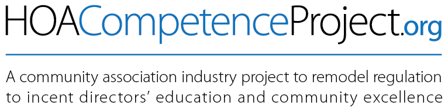

This site is for you and others living in and serving community
associations to participate in developing a solution to the long-term
conundrum: **How to increase competence of volunteer Community
Association directors without discouraging volunteerism.**

<figure></figure>

I’m George Markle. I’ve been involved with homeowners associations for
the past four decades and authored the *Homeowners Association
Directors’ Survival Kit*.

Anyone involved professionally or on a board of a community association
is familiar with the dearth of willing, qualified volunteers competent
in the skills of overseeing what for many of its members constitutes the
bulk of their net worth. Normal means for ensuring competence for such
stewardship involves the state requiring certification and licensure for
those positioned to imact lives so profoundly. However, the conundrum
plaguing communitites accross our country is the untenable burden for
unpaid volunteers to pursue such credentialling — with no remuneration
or ostensible personal reward and the prospect of absorbing relentless
political ire. Who in their right mind would serve in this roll?!

Thus, we have all seen and read about consequences of unsophisticated
governance of community associations — from petty irritations of hapless
adminstration of architectural applications preventing a homeowner from
flying a flag, to catastrophic loss and devestation of an entire
community and lost lives, resulting from failure to maintain adequate
reserves for buliding infrustructure maintenance.

For the past few years I’ve contemplated this as-yet unsolved puzzle of
essential requirements for competent oversight vs. circumstances
malignantly aligned to defeat it. I finally began crafting a plan — a
decidedly unconventional approach involving incentives to education and
improve competency for community association directors. And it explodes
conventional local- and state government barriers to involve the
marketplace. Get ready for an interesting ride.

### State of affairs

Language in the examples is for California, one of the states leading
the nation in community association legislation. But language can
modified for any state. If you have suggestions particular to another
state, just let us know by clicking *Contact* at the top of the [home
page](https://hoacompetenceproject.org). We’ll create a new folder for
your state.

### Heads up

Opening this project for many contributors has the potential to craft a
truly great and effective program. We can use each other’s help on all
aspects, including sanity checks, legal review, awareness of potential
unexpected barriers and a raft of other surprises certain to arise.
It’ll be an adventure!

<figure></figure>

### Legislation won’t write itself

So please gander the plan and share your comments and suggestions so we
can make it better — before we begin working with our legislators to
implement.

# Contact

Actually… the
[HOACompetenceProject.org](https://www.hoacompetenceproject.org) website
with its [discussions
forum](https://hoacompetenceproject.org/pages/forum.php) is a great way
for participating in this effort. But if you’re comfortable using
GitHub, that will expedite development, particularly if you are an
attorney willing to help draft legislation. (I’m clearly not an attorney
and while I’ve made a lay effort to adapt existing legislation for this,
we need professional help. Please helpby drafting possible legislation
to bring this program to reality.

While this program was created with the California legislature in mind,
Community Association owners, professionals and legislators across the
country can participate here in crafting a program that can be adapted
for other states. If your state requires an adjustment to accommodate a
law, just label your changes particular to that state.

This is a great opportunity for you to help shape future legislation.

